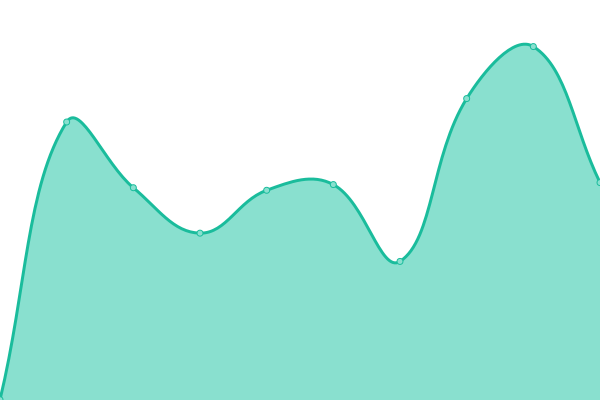

# [📈 Live Status](https://demo.upptime.js.org): <!--live status--> **🟩 All systems operational**

This repository contains the open-source uptime monitor and status page for [Upptime](https://upptime.js.org), powered by [Upptime](https://github.com/upptime/upptime).

With [Upptime](https://upptime.js.org), you can get your own unlimited and free uptime monitor and status page, powered entirely by a GitHub repository. We use [Issues](https://github.com/upptime/upptime/issues) as incident reports, [Actions](https://github.com/TigreGotico/public-servers/actions) as uptime monitors, and [Pages](https://demo.upptime.js.org) for the status page.

<!--start: status pages-->
<!-- This summary is generated by Upptime (https://github.com/upptime/upptime) -->
<!-- Do not edit this manually, your changes will be overwritten -->
<!-- prettier-ignore -->
| URL | Status | History | Response Time | Uptime |
| --- | ------ | ------- | ------------- | ------ |
|  [TTS - NOS](https://nos.tigregotico.pt/status) | 🟩 Up | [tts-nos.yml](https://github.com/TigreGotico/public-servers/commits/HEAD/history/tts-nos.yml) | 

 1036ms
     
 | 

<a href="https://TigreGotico.github.io/public-servers/history/tts-nos">98.76%</a>
    

|  [TTS - Matxa](https://matxa.tigregotico.pt/status) | 🟩 Up | [tts-matxa.yml](https://github.com/TigreGotico/public-servers/commits/HEAD/history/tts-matxa.yml) | 

 777ms
     
 | 

<a href="https://TigreGotico.github.io/public-servers/history/tts-matxa">99.38%</a>
    

|  [TTS - Piper](https://piper.tigregotico.pt/status) | 🟩 Up | [tts-piper.yml](https://github.com/TigreGotico/public-servers/commits/HEAD/history/tts-piper.yml) | 

 761ms
     
 | 

<a href="https://TigreGotico.github.io/public-servers/history/tts-piper">98.79%</a>
    

|  [TTS - Mimic](https://mimic.tigregotico.pt/status) | 🟩 Up | [tts-mimic.yml](https://github.com/TigreGotico/public-servers/commits/HEAD/history/tts-mimic.yml) | 

 980ms
     
 | 

<a href="https://TigreGotico.github.io/public-servers/history/tts-mimic">98.87%</a>
    

|  [TTS - SAM](https://sam.tigregotico.pt/status) | 🟩 Up | [tts-sam.yml](https://github.com/TigreGotico/public-servers/commits/HEAD/history/tts-sam.yml) | 

 804ms
     
 | 

<a href="https://TigreGotico.github.io/public-servers/history/tts-sam">98.90%</a>
    

|  [STT - FasterWhisper (turbo-v3)](https://fasterwhisper.tigregotico.pt/status) | 🟩 Up | [stt-faster-whisper-turbo-v3.yml](https://github.com/TigreGotico/public-servers/commits/HEAD/history/stt-faster-whisper-turbo-v3.yml) | 

 779ms
     
 | 

<a href="https://TigreGotico.github.io/public-servers/history/stt-faster-whisper-turbo-v3">98.93%</a>
    

|  [STT - Citrinet](https://citrinet.tigregotico.pt/status) | 🟩 Up | [stt-citrinet.yml](https://github.com/TigreGotico/public-servers/commits/HEAD/history/stt-citrinet.yml) | 

 736ms
     
 | 

<a href="https://TigreGotico.github.io/public-servers/history/stt-citrinet">98.96%</a>
    

|  [STT - Vosk](https://vosk.tigregotico.pt/status) | 🟩 Up | [stt-vosk.yml](https://github.com/TigreGotico/public-servers/commits/HEAD/history/stt-vosk.yml) | 

 723ms
     
 | 

<a href="https://TigreGotico.github.io/public-servers/history/stt-vosk">98.99%</a>
    

|  [STT - Google Chromium (proxy)](https://chromium.tigregotico.pt/status) | 🟩 Up | [stt-google-chromium-proxy.yml](https://github.com/TigreGotico/public-servers/commits/HEAD/history/stt-google-chromium-proxy.yml) | 

 814ms
     
 | 

<a href="https://TigreGotico.github.io/public-servers/history/stt-google-chromium-proxy">99.02%</a>
    

|  [Translate - NLLB](https://nllb.tigregotico.pt/status) | 🟩 Up | [translate-nllb.yml](https://github.com/TigreGotico/public-servers/commits/HEAD/history/translate-nllb.yml) | 

 854ms
     
 | 

<a href="https://TigreGotico.github.io/public-servers/history/translate-nllb">99.05%</a>
    

|  [Translate - Google (proxy)](https://google-translate.tigregotico.pt/status) | 🟩 Up | [translate-google-proxy.yml](https://github.com/TigreGotico/public-servers/commits/HEAD/history/translate-google-proxy.yml) | 

 725ms
     
 | 

<a href="https://TigreGotico.github.io/public-servers/history/translate-google-proxy">99.15%</a>
    

|  [Persona - OVOS Helpbot](https://ovos-helpbot.tigregotico.pt/status) | 🟩 Up | [persona-ovos-helpbot.yml](https://github.com/TigreGotico/public-servers/commits/HEAD/history/persona-ovos-helpbot.yml) | 

 727ms
     
 | 

<a href="https://TigreGotico.github.io/public-servers/history/persona-ovos-helpbot">95.53%</a>
    

|  [Persona - Command R](https://command-r.tigregotico.pt/status) | 🟩 Up | [persona-command-r.yml](https://github.com/TigreGotico/public-servers/commits/HEAD/history/persona-command-r.yml) | 

 571ms
     
 | 

<a href="https://TigreGotico.github.io/public-servers/history/persona-command-r">100.00%</a>
    

|  [Persona - Dolphin](https://dolphin.tigregotico.pt/status) | 🟩 Up | [persona-dolphin.yml](https://github.com/TigreGotico/public-servers/commits/HEAD/history/persona-dolphin.yml) | 

 626ms
     
 | 

<a href="https://TigreGotico.github.io/public-servers/history/persona-dolphin">100.00%</a>
    

|  [Persona - Gemma](https://gemma2.tigregotico.pt/status) | 🟩 Up | [persona-gemma.yml](https://github.com/TigreGotico/public-servers/commits/HEAD/history/persona-gemma.yml) | 

 565ms
     
 | 

<a href="https://TigreGotico.github.io/public-servers/history/persona-gemma">100.00%</a>
    

|  [Persona - Granite](https://granite.tigregotico.pt/status) | 🟩 Up | [persona-granite.yml](https://github.com/TigreGotico/public-servers/commits/HEAD/history/persona-granite.yml) | 

 590ms
     
 | 

<a href="https://TigreGotico.github.io/public-servers/history/persona-granite">100.00%</a>
    

|  [Persona - LLama Vision](https://llama-vision.tigregotico.pt/status) | 🟩 Up | [persona-l-lama-vision.yml](https://github.com/TigreGotico/public-servers/commits/HEAD/history/persona-l-lama-vision.yml) | 

 624ms
     
 | 

<a href="https://TigreGotico.github.io/public-servers/history/persona-l-lama-vision">100.00%</a>
    

|  [Persona - LLava Phi3](https://llava-phi3.tigregotico.pt/status) | 🟩 Up | [persona-l-lava-phi3.yml](https://github.com/TigreGotico/public-servers/commits/HEAD/history/persona-l-lava-phi3.yml) | 

 571ms
     
 | 

<a href="https://TigreGotico.github.io/public-servers/history/persona-l-lava-phi3">100.00%</a>
    

|  [Persona - Mini CPM V](https://minicpm-v.tigregotico.pt/status) | 🟩 Up | [persona-mini-cpm-v.yml](https://github.com/TigreGotico/public-servers/commits/HEAD/history/persona-mini-cpm-v.yml) | 

 618ms
     
 | 

<a href="https://TigreGotico.github.io/public-servers/history/persona-mini-cpm-v">100.00%</a>
    

|  [Persona - Mistral Nemo](https://mistral-nemo.tigregotico.pt/status) | 🟩 Up | [persona-mistral-nemo.yml](https://github.com/TigreGotico/public-servers/commits/HEAD/history/persona-mistral-nemo.yml) | 

 595ms
     
 | 

<a href="https://TigreGotico.github.io/public-servers/history/persona-mistral-nemo">100.00%</a>
    

|  [Persona - Olmo](https://olmo2.tigregotico.pt/status) | 🟩 Up | [persona-olmo.yml](https://github.com/TigreGotico/public-servers/commits/HEAD/history/persona-olmo.yml) | 

 566ms
     
 | 

<a href="https://TigreGotico.github.io/public-servers/history/persona-olmo">100.00%</a>
    

|  [Persona - Phi4](https://phi4.tigregotico.pt/status) | 🟩 Up | [persona-phi4.yml](https://github.com/TigreGotico/public-servers/commits/HEAD/history/persona-phi4.yml) | 

 773ms
     
 | 

<a href="https://TigreGotico.github.io/public-servers/history/persona-phi4">97.55%</a>
    

|  [Persona - Phi4 Mini](https://phi4-mini.tigregotico.pt/status) | 🟩 Up | [persona-phi4-mini.yml](https://github.com/TigreGotico/public-servers/commits/HEAD/history/persona-phi4-mini.yml) | 

 570ms
     
 | 

<a href="https://TigreGotico.github.io/public-servers/history/persona-phi4-mini">100.00%</a>
    

|  [Persona - Qwen2.5](https://qwen.tigregotico.pt/status) | 🟩 Up | [persona-qwen2-5.yml](https://github.com/TigreGotico/public-servers/commits/HEAD/history/persona-qwen2-5.yml) | 

 698ms
     
 | 

<a href="https://TigreGotico.github.io/public-servers/history/persona-qwen2-5">97.53%</a>
    

|  [Persona - Qwen2.5 Coder](https://qwen-coder.tigregotico.pt/status) | 🟩 Up | [persona-qwen2-5-coder.yml](https://github.com/TigreGotico/public-servers/commits/HEAD/history/persona-qwen2-5-coder.yml) | 

 579ms
     
 | 

<a href="https://TigreGotico.github.io/public-servers/history/persona-qwen2-5-coder">100.00%</a>
    

|  [Persona - Salamandra](https://salamandra.tigregotico.pt/status) | 🟩 Up | [persona-salamandra.yml](https://github.com/TigreGotico/public-servers/commits/HEAD/history/persona-salamandra.yml) | 

 717ms
     
 | 

<a href="https://TigreGotico.github.io/public-servers/history/persona-salamandra">98.45%</a>
    

|  [Persona - Claude (proxy)](https://claude.tigregotico.pt/status) | 🟩 Up | [persona-claude-proxy.yml](https://github.com/TigreGotico/public-servers/commits/HEAD/history/persona-claude-proxy.yml) | 

 635ms
     
 | 

<a href="https://TigreGotico.github.io/public-servers/history/persona-claude-proxy">97.74%</a>
    

|  [Persona - GPT-4o-mini (proxy)](https://gpt4.tigregotico.pt/status) | 🟩 Up | [persona-gpt-4o-mini-proxy.yml](https://github.com/TigreGotico/public-servers/commits/HEAD/history/persona-gpt-4o-mini-proxy.yml) | 

 682ms
     
 | 

<a href="https://TigreGotico.github.io/public-servers/history/persona-gpt-4o-mini-proxy">97.76%</a>
    

|  [Benchmark - TTS](https://tts-bench.tigregotico.pt) | 🟩 Up | [benchmark-tts.yml](https://github.com/TigreGotico/public-servers/commits/HEAD/history/benchmark-tts.yml) | 

 675ms
     
 | 

<a href="https://TigreGotico.github.io/public-servers/history/benchmark-tts">75.01%</a>
    

|  [Benchmark - STT](https://stt-bench.tigregotico.pt) | 🟩 Up | [benchmark-stt.yml](https://github.com/TigreGotico/public-servers/commits/HEAD/history/benchmark-stt.yml) | 

 633ms
     
 | 

<a href="https://TigreGotico.github.io/public-servers/history/benchmark-stt">75.01%</a>
    

|  [Benchmark - Gitlocalize](https://gitlocalize-bench.tigregotico.pt) | 🟩 Up | [benchmark-gitlocalize.yml](https://github.com/TigreGotico/public-servers/commits/HEAD/history/benchmark-gitlocalize.yml) | 

 633ms
     
 | 

<a href="https://TigreGotico.github.io/public-servers/history/benchmark-gitlocalize">75.01%</a>
    

|  [Benchmark - Meteocat](https://meteocat.bench.tigregotico.pt) | 🟩 Up | [benchmark-meteocat.yml](https://github.com/TigreGotico/public-servers/commits/HEAD/history/benchmark-meteocat.yml) | 

 645ms
     
 | 

<a href="https://TigreGotico.github.io/public-servers/history/benchmark-meteocat">75.01%</a>
    

<!--end: status pages-->

[**Visit our status website →**](https://demo.upptime.js.org)

## 📄 License

- Powered by: [Upptime](https://github.com/upptime/upptime)
- Code: [MIT](./LICENSE) © [Anand Chowdhary](https://anandchowdhary.com), supported by [Pabio](https://pabio.com)
- Data in the `./history` directory: [Open Database License](https://opendatacommons.org/licenses/odbl/1-0/)
