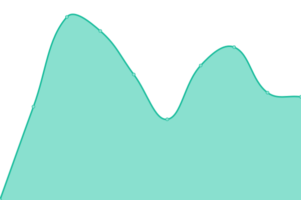

# [📈 Live Status](https://demo.upptime.js.org): <!--live status--> **🟧 Partial outage**

This repository contains the open-source uptime monitor and status page for [Upptime](https://upptime.js.org), powered by [Upptime](https://github.com/upptime/upptime).

With [Upptime](https://upptime.js.org), you can get your own unlimited and free uptime monitor and status page, powered entirely by a GitHub repository. We use [Issues](https://github.com/upptime/upptime/issues) as incident reports, [Actions](https://github.com/TigreGotico/public-servers/actions) as uptime monitors, and [Pages](https://demo.upptime.js.org) for the status page.

<!--start: status pages-->
<!-- This summary is generated by Upptime (https://github.com/upptime/upptime) -->
<!-- Do not edit this manually, your changes will be overwritten -->
<!-- prettier-ignore -->
| URL | Status | History | Response Time | Uptime |
| --- | ------ | ------- | ------------- | ------ |
|  [OpenData - Metrics API](https://metrics.tigregotico.pt/status) | 🟩 Up | [open-data-metrics-api.yml](https://github.com/TigreGotico/public-servers/commits/HEAD/history/open-data-metrics-api.yml) | 

 821ms
     
 | 

<a href="https://TigreGotico.github.io/public-servers/history/open-data-metrics-api">82.32%</a>
    

|  [OpenData - Dashboard](https://opendata.tigregotico.pt) | 🟩 Up | [open-data-dashboard.yml](https://github.com/TigreGotico/public-servers/commits/HEAD/history/open-data-dashboard.yml) | 

 1312ms
     
 | 

<a href="https://TigreGotico.github.io/public-servers/history/open-data-dashboard">60.24%</a>
    

|  [TTS - NOS](https://nos.tigregotico.pt/status) | 🟩 Up | [tts-nos.yml](https://github.com/TigreGotico/public-servers/commits/HEAD/history/tts-nos.yml) | 

 828ms
     
 | 

<a href="https://TigreGotico.github.io/public-servers/history/tts-nos">82.99%</a>
    

|  [TTS - Matxa](https://matxa.tigregotico.pt/status) | 🟩 Up | [tts-matxa.yml](https://github.com/TigreGotico/public-servers/commits/HEAD/history/tts-matxa.yml) | 

 1288ms
     
 | 

<a href="https://TigreGotico.github.io/public-servers/history/tts-matxa">83.28%</a>
    

|  [TTS - Piper](https://piper.tigregotico.pt/status) | 🟩 Up | [tts-piper.yml](https://github.com/TigreGotico/public-servers/commits/HEAD/history/tts-piper.yml) | 

 1474ms
     
 | 

<a href="https://TigreGotico.github.io/public-servers/history/tts-piper">83.64%</a>
    

|  [TTS - Mimic](https://mimic.tigregotico.pt/status) | 🟩 Up | [tts-mimic.yml](https://github.com/TigreGotico/public-servers/commits/HEAD/history/tts-mimic.yml) | 

 709ms
     
 | 

<a href="https://TigreGotico.github.io/public-servers/history/tts-mimic">83.79%</a>
    

|  [TTS - SAM](https://sam.tigregotico.pt/status) | 🟩 Up | [tts-sam.yml](https://github.com/TigreGotico/public-servers/commits/HEAD/history/tts-sam.yml) | 

 675ms
     
 | 

<a href="https://TigreGotico.github.io/public-servers/history/tts-sam">83.88%</a>
    

|  [STT - FasterWhisper (turbo-large-v3)](https://fasterwhisper.tigregotico.pt/status) | 🟥 Down | [stt-faster-whisper-turbo-large-v3.yml](https://github.com/TigreGotico/public-servers/commits/HEAD/history/stt-faster-whisper-turbo-large-v3.yml) | 

 651ms
     
 | 

<a href="https://TigreGotico.github.io/public-servers/history/stt-faster-whisper-turbo-large-v3">92.77%</a>
    

|  [STT - Citrinet](https://citrinet.tigregotico.pt/status) | 🟩 Up | [stt-citrinet.yml](https://github.com/TigreGotico/public-servers/commits/HEAD/history/stt-citrinet.yml) | 

 716ms
     
 | 

<a href="https://TigreGotico.github.io/public-servers/history/stt-citrinet">83.15%</a>
    

|  [STT - Whisper (GPU)](https://whisper.tigregotico.pt/status) | 🟩 Up | [stt-whisper-gpu.yml](https://github.com/TigreGotico/public-servers/commits/HEAD/history/stt-whisper-gpu.yml) | 

 631ms
     
 | 

<a href="https://TigreGotico.github.io/public-servers/history/stt-whisper-gpu">88.14%</a>
    

|  [STT - MyNorthAI (GPU)](https://mynorthai.tigregotico.pt/status) | 🟩 Up | [stt-my-north-ai-gpu.yml](https://github.com/TigreGotico/public-servers/commits/HEAD/history/stt-my-north-ai-gpu.yml) | 

 595ms
     
 | 

<a href="https://TigreGotico.github.io/public-servers/history/stt-my-north-ai-gpu">90.70%</a>
    

|  [STT - Whisper Xabier Zuazo - ES (GPU)](https://zuazo-es.tigregotico.pt/status) | 🟩 Up | [stt-whisper-xabier-zuazo-es-gpu.yml](https://github.com/TigreGotico/public-servers/commits/HEAD/history/stt-whisper-xabier-zuazo-es-gpu.yml) | 

 659ms
     
 | 

<a href="https://TigreGotico.github.io/public-servers/history/stt-whisper-xabier-zuazo-es-gpu">89.91%</a>
    

|  [STT - Whisper Xabier Zuazo - GL (GPU)](https://zuazo-gl.tigregotico.pt/status) | 🟩 Up | [stt-whisper-xabier-zuazo-gl-gpu.yml](https://github.com/TigreGotico/public-servers/commits/HEAD/history/stt-whisper-xabier-zuazo-gl-gpu.yml) | 

 637ms
     
 | 

<a href="https://TigreGotico.github.io/public-servers/history/stt-whisper-xabier-zuazo-gl-gpu">89.91%</a>
    

|  [STT - HiTZ (GPU)](https://hitz.tigregotico.pt/status) | 🟩 Up | [stt-hi-tz-gpu.yml](https://github.com/TigreGotico/public-servers/commits/HEAD/history/stt-hi-tz-gpu.yml) | 

 637ms
     
 | 

<a href="https://TigreGotico.github.io/public-servers/history/stt-hi-tz-gpu">80.84%</a>
    

|  [STT - Google Chromium (proxy)](https://chromium.tigregotico.pt/status) | 🟩 Up | [stt-google-chromium-proxy.yml](https://github.com/TigreGotico/public-servers/commits/HEAD/history/stt-google-chromium-proxy.yml) | 

 1557ms
     
 | 

<a href="https://TigreGotico.github.io/public-servers/history/stt-google-chromium-proxy">97.55%</a>
    

|  [Translate - NLLB](https://nllb.tigregotico.pt/status) | 🟩 Up | [translate-nllb.yml](https://github.com/TigreGotico/public-servers/commits/HEAD/history/translate-nllb.yml) | 

 698ms
     
 | 

<a href="https://TigreGotico.github.io/public-servers/history/translate-nllb">81.65%</a>
    

|  [Translate - Google (proxy)](https://google-translate.tigregotico.pt/status) | 🟩 Up | [translate-google-proxy.yml](https://github.com/TigreGotico/public-servers/commits/HEAD/history/translate-google-proxy.yml) | 

 636ms
     
 | 

<a href="https://TigreGotico.github.io/public-servers/history/translate-google-proxy">97.33%</a>
    

|  [Persona - HiveMind](https://hivemind-persona.tigregotico.pt/status) | 🟥 Down | [persona-hive-mind.yml](https://github.com/TigreGotico/public-servers/commits/HEAD/history/persona-hive-mind.yml) | 

 594ms
     
 | 

<a href="https://TigreGotico.github.io/public-servers/history/persona-hive-mind">56.04%</a>
    

|  [Persona - OVOS Helpbot](https://ovos-helpbot.tigregotico.pt/status) | 🟥 Down | [persona-ovos-helpbot.yml](https://github.com/TigreGotico/public-servers/commits/HEAD/history/persona-ovos-helpbot.yml) | 

 608ms
     
 | 

<a href="https://TigreGotico.github.io/public-servers/history/persona-ovos-helpbot">63.55%</a>
    

|  [Persona - Aya Extreme](https://aya.tigregotico.pt/status) | 🟥 Down | [persona-aya-extreme.yml](https://github.com/TigreGotico/public-servers/commits/HEAD/history/persona-aya-extreme.yml) | 

 611ms
     
 | 

<a href="https://TigreGotico.github.io/public-servers/history/persona-aya-extreme">63.56%</a>
    

|  [Persona - Command R](https://command-r.tigregotico.pt/status) | 🟩 Up | [persona-command-r.yml](https://github.com/TigreGotico/public-servers/commits/HEAD/history/persona-command-r.yml) | 

 995ms
     
 | 

<a href="https://TigreGotico.github.io/public-servers/history/persona-command-r">96.19%</a>
    

|  [Persona - Deepscaler](https://deepscaler.tigregotico.pt/status) | 🟩 Up | [persona-deepscaler.yml](https://github.com/TigreGotico/public-servers/commits/HEAD/history/persona-deepscaler.yml) | 

 844ms
     
 | 

<a href="https://TigreGotico.github.io/public-servers/history/persona-deepscaler">96.22%</a>
    

|  [Persona - Deepseek](https://deepseek.tigregotico.pt/status) | 🟩 Up | [persona-deepseek.yml](https://github.com/TigreGotico/public-servers/commits/HEAD/history/persona-deepseek.yml) | 

 906ms
     
 | 

<a href="https://TigreGotico.github.io/public-servers/history/persona-deepseek">96.44%</a>
    

|  [Persona - Dolphin](https://dolphin.tigregotico.pt/status) | 🟩 Up | [persona-dolphin.yml](https://github.com/TigreGotico/public-servers/commits/HEAD/history/persona-dolphin.yml) | 

 647ms
     
 | 

<a href="https://TigreGotico.github.io/public-servers/history/persona-dolphin">96.48%</a>
    

|  [Persona - Falcon](https://falcon.tigregotico.pt/status) | 🟩 Up | [persona-falcon.yml](https://github.com/TigreGotico/public-servers/commits/HEAD/history/persona-falcon.yml) | 

 979ms
     
 | 

<a href="https://TigreGotico.github.io/public-servers/history/persona-falcon">96.51%</a>
    

|  [Persona - Gemma](https://gemma.tigregotico.pt/status) | 🟩 Up | [persona-gemma.yml](https://github.com/TigreGotico/public-servers/commits/HEAD/history/persona-gemma.yml) | 

 986ms
     
 | 

<a href="https://TigreGotico.github.io/public-servers/history/persona-gemma">96.54%</a>
    

|  [Persona - Gemma (12b)](https://gemma-12b.tigregotico.pt/status) | 🟩 Up | [persona-gemma-12b.yml](https://github.com/TigreGotico/public-servers/commits/HEAD/history/persona-gemma-12b.yml) | 

 884ms
     
 | 

<a href="https://TigreGotico.github.io/public-servers/history/persona-gemma-12b">96.57%</a>
    

|  [Persona - GLM 4](https://glm4.tigregotico.pt/status) | 🟩 Up | [persona-glm-4.yml](https://github.com/TigreGotico/public-servers/commits/HEAD/history/persona-glm-4.yml) | 

 670ms
     
 | 

<a href="https://TigreGotico.github.io/public-servers/history/persona-glm-4">96.14%</a>
    

|  [Persona - Granite](https://granite.tigregotico.pt/status) | 🟩 Up | [persona-granite.yml](https://github.com/TigreGotico/public-servers/commits/HEAD/history/persona-granite.yml) | 

 612ms
     
 | 

<a href="https://TigreGotico.github.io/public-servers/history/persona-granite">83.34%</a>
    

|  [Persona - Hermes](https://hermes.tigregotico.pt/status) | 🟩 Up | [persona-hermes.yml](https://github.com/TigreGotico/public-servers/commits/HEAD/history/persona-hermes.yml) | 

 583ms
     
 | 

<a href="https://TigreGotico.github.io/public-servers/history/persona-hermes">83.37%</a>
    

|  [Persona - LLama Vision](https://llama-vision.tigregotico.pt/status) | 🟩 Up | [persona-l-lama-vision.yml](https://github.com/TigreGotico/public-servers/commits/HEAD/history/persona-l-lama-vision.yml) | 

 600ms
     
 | 

<a href="https://TigreGotico.github.io/public-servers/history/persona-l-lama-vision">83.40%</a>
    

|  [Persona - LLava Phi3](https://llava-phi3.tigregotico.pt/status) | 🟩 Up | [persona-l-lava-phi3.yml](https://github.com/TigreGotico/public-servers/commits/HEAD/history/persona-l-lava-phi3.yml) | 

 640ms
     
 | 

<a href="https://TigreGotico.github.io/public-servers/history/persona-l-lava-phi3">96.29%</a>
    

|  [Persona - Mathstral](https://mathstral.tigregotico.pt/status) | 🟩 Up | [persona-mathstral.yml](https://github.com/TigreGotico/public-servers/commits/HEAD/history/persona-mathstral.yml) | 

 647ms
     
 | 

<a href="https://TigreGotico.github.io/public-servers/history/persona-mathstral">91.42%</a>
    

|  [Persona - Mini CPM V](https://minicpm-v.tigregotico.pt/status) | 🟩 Up | [persona-mini-cpm-v.yml](https://github.com/TigreGotico/public-servers/commits/HEAD/history/persona-mini-cpm-v.yml) | 

 1855ms
     
 | 

<a href="https://TigreGotico.github.io/public-servers/history/persona-mini-cpm-v">96.35%</a>
    

|  [Persona - Mistral Nemo](https://mistral-nemo.tigregotico.pt/status) | 🟩 Up | [persona-mistral-nemo.yml](https://github.com/TigreGotico/public-servers/commits/HEAD/history/persona-mistral-nemo.yml) | 

 613ms
     
 | 

<a href="https://TigreGotico.github.io/public-servers/history/persona-mistral-nemo">96.38%</a>
    

|  [Persona - Mistral](https://mistral.tigregotico.pt/status) | 🟩 Up | [persona-mistral.yml](https://github.com/TigreGotico/public-servers/commits/HEAD/history/persona-mistral.yml) | 

 616ms
     
 | 

<a href="https://TigreGotico.github.io/public-servers/history/persona-mistral">83.55%</a>
    

|  [Persona - Nemotron](https://nemotron.tigregotico.pt/status) | 🟩 Up | [persona-nemotron.yml](https://github.com/TigreGotico/public-servers/commits/HEAD/history/persona-nemotron.yml) | 

 609ms
     
 | 

<a href="https://TigreGotico.github.io/public-servers/history/persona-nemotron">83.58%</a>
    

|  [Persona - Olmo](https://olmo2.tigregotico.pt/status) | 🟩 Up | [persona-olmo.yml](https://github.com/TigreGotico/public-servers/commits/HEAD/history/persona-olmo.yml) | 

 601ms
     
 | 

<a href="https://TigreGotico.github.io/public-servers/history/persona-olmo">83.61%</a>
    

|  [Persona - Open Thinker](https://openthinker.tigregotico.pt/status) | 🟩 Up | [persona-open-thinker.yml](https://github.com/TigreGotico/public-servers/commits/HEAD/history/persona-open-thinker.yml) | 

 597ms
     
 | 

<a href="https://TigreGotico.github.io/public-servers/history/persona-open-thinker">83.64%</a>
    

|  [Persona - Phi4](https://phi4.tigregotico.pt/status) | 🟩 Up | [persona-phi4.yml](https://github.com/TigreGotico/public-servers/commits/HEAD/history/persona-phi4.yml) | 

 600ms
     
 | 

<a href="https://TigreGotico.github.io/public-servers/history/persona-phi4">83.67%</a>
    

|  [Persona - Phi4 Mini](https://phi4-mini.tigregotico.pt/status) | 🟩 Up | [persona-phi4-mini.yml](https://github.com/TigreGotico/public-servers/commits/HEAD/history/persona-phi4-mini.yml) | 

 629ms
     
 | 

<a href="https://TigreGotico.github.io/public-servers/history/persona-phi4-mini">83.69%</a>
    

|  [Persona - Qwen2.5](https://qwen.tigregotico.pt/status) | 🟩 Up | [persona-qwen2-5.yml](https://github.com/TigreGotico/public-servers/commits/HEAD/history/persona-qwen2-5.yml) | 

 600ms
     
 | 

<a href="https://TigreGotico.github.io/public-servers/history/persona-qwen2-5">83.71%</a>
    

|  [Persona - Qwen2.5 Coder](https://qwen-coder.tigregotico.pt/status) | 🟩 Up | [persona-qwen2-5-coder.yml](https://github.com/TigreGotico/public-servers/commits/HEAD/history/persona-qwen2-5-coder.yml) | 

 627ms
     
 | 

<a href="https://TigreGotico.github.io/public-servers/history/persona-qwen2-5-coder">83.73%</a>
    

|  [Persona - ReaderLM](https://reader-lm.tigregotico.pt/status) | 🟩 Up | [persona-reader-lm.yml](https://github.com/TigreGotico/public-servers/commits/HEAD/history/persona-reader-lm.yml) | 

 601ms
     
 | 

<a href="https://TigreGotico.github.io/public-servers/history/persona-reader-lm">83.75%</a>
    

|  [Persona - Salamandra](https://salamandra.tigregotico.pt/status) | 🟩 Up | [persona-salamandra.yml](https://github.com/TigreGotico/public-servers/commits/HEAD/history/persona-salamandra.yml) | 

 623ms
     
 | 

<a href="https://TigreGotico.github.io/public-servers/history/persona-salamandra">95.52%</a>
    

|  [Persona - Small Thinker](https://smallthinker.tigregotico.pt/status) | 🟩 Up | [persona-small-thinker.yml](https://github.com/TigreGotico/public-servers/commits/HEAD/history/persona-small-thinker.yml) | 

 614ms
     
 | 

<a href="https://TigreGotico.github.io/public-servers/history/persona-small-thinker">95.54%</a>
    

|  [Persona - Smollm](https://smollm.tigregotico.pt/status) | 🟩 Up | [persona-smollm.yml](https://github.com/TigreGotico/public-servers/commits/HEAD/history/persona-smollm.yml) | 

 623ms
     
 | 

<a href="https://TigreGotico.github.io/public-servers/history/persona-smollm">83.80%</a>
    

|  [Persona - Solar](https://solar.tigregotico.pt/status) | 🟩 Up | [persona-solar.yml](https://github.com/TigreGotico/public-servers/commits/HEAD/history/persona-solar.yml) | 

 599ms
     
 | 

<a href="https://TigreGotico.github.io/public-servers/history/persona-solar">83.82%</a>
    

|  [Persona - Tiny Dolphin](https://tiny-dolphin.tigregotico.pt/status) | 🟩 Up | [persona-tiny-dolphin.yml](https://github.com/TigreGotico/public-servers/commits/HEAD/history/persona-tiny-dolphin.yml) | 

 612ms
     
 | 

<a href="https://TigreGotico.github.io/public-servers/history/persona-tiny-dolphin">83.84%</a>
    

|  [Persona - Tiny Llama](https://tiny-llama.tigregotico.pt/status) | 🟩 Up | [persona-tiny-llama.yml](https://github.com/TigreGotico/public-servers/commits/HEAD/history/persona-tiny-llama.yml) | 

 598ms
     
 | 

<a href="https://TigreGotico.github.io/public-servers/history/persona-tiny-llama">83.86%</a>
    

|  [Persona - Tulu](https://tulu.tigregotico.pt/status) | 🟩 Up | [persona-tulu.yml](https://github.com/TigreGotico/public-servers/commits/HEAD/history/persona-tulu.yml) | 

 607ms
     
 | 

<a href="https://TigreGotico.github.io/public-servers/history/persona-tulu">83.89%</a>
    

|  [Persona - Claude (proxy)](https://claude.tigregotico.pt/status) | 🟩 Up | [persona-claude-proxy.yml](https://github.com/TigreGotico/public-servers/commits/HEAD/history/persona-claude-proxy.yml) | 

 598ms
     
 | 

<a href="https://TigreGotico.github.io/public-servers/history/persona-claude-proxy">83.92%</a>
    

|  [Persona - GPT-4o-mini (proxy)](https://gpt4.tigregotico.pt/status) | 🟩 Up | [persona-gpt-4o-mini-proxy.yml](https://github.com/TigreGotico/public-servers/commits/HEAD/history/persona-gpt-4o-mini-proxy.yml) | 

 622ms
     
 | 

<a href="https://TigreGotico.github.io/public-servers/history/persona-gpt-4o-mini-proxy">96.19%</a>
    

|  [Persona - Mixtral (proxy)](https://mixtral.tigregotico.pt/status) | 🟩 Up | [persona-mixtral-proxy.yml](https://github.com/TigreGotico/public-servers/commits/HEAD/history/persona-mixtral-proxy.yml) | 

 616ms
     
 | 

<a href="https://TigreGotico.github.io/public-servers/history/persona-mixtral-proxy">96.22%</a>
    

|  [Benchmark - TTS](https://tts-bench.tigregotico.pt) | 🟩 Up | [benchmark-tts.yml](https://github.com/TigreGotico/public-servers/commits/HEAD/history/benchmark-tts.yml) | 

 1481ms
     
 | 

<a href="https://TigreGotico.github.io/public-servers/history/benchmark-tts">83.90%</a>
    

|  [Benchmark - STT](https://stt-bench.tigregotico.pt) | 🟩 Up | [benchmark-stt.yml](https://github.com/TigreGotico/public-servers/commits/HEAD/history/benchmark-stt.yml) | 

 592ms
     
 | 

<a href="https://TigreGotico.github.io/public-servers/history/benchmark-stt">83.92%</a>
    

|  [Benchmark - Gitlocalize](https://gitlocalize-bench.tigregotico.pt) | 🟩 Up | [benchmark-gitlocalize.yml](https://github.com/TigreGotico/public-servers/commits/HEAD/history/benchmark-gitlocalize.yml) | 

 589ms
     
 | 

<a href="https://TigreGotico.github.io/public-servers/history/benchmark-gitlocalize">83.93%</a>
    

|  [Benchmark - Meteocat](https://meteocat.bench.tigregotico.pt) | 🟩 Up | [benchmark-meteocat.yml](https://github.com/TigreGotico/public-servers/commits/HEAD/history/benchmark-meteocat.yml) | 

 590ms
     
 | 

<a href="https://TigreGotico.github.io/public-servers/history/benchmark-meteocat">83.00%</a>
    

<!--end: status pages-->

[**Visit our status website →**](https://demo.upptime.js.org)

## 📄 License

- Powered by: [Upptime](https://github.com/upptime/upptime)
- Code: [MIT](./LICENSE) © [Anand Chowdhary](https://anandchowdhary.com), supported by [Pabio](https://pabio.com)
- Data in the `./history` directory: [Open Database License](https://opendatacommons.org/licenses/odbl/1-0/)
