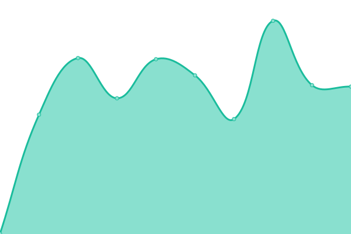

# [📈 Live Status](https://demo.upptime.js.org): <!--live status--> **🟧 Partial outage**

This repository contains the open-source uptime monitor and status page for [Upptime](https://upptime.js.org), powered by [Upptime](https://github.com/upptime/upptime).

With [Upptime](https://upptime.js.org), you can get your own unlimited and free uptime monitor and status page, powered entirely by a GitHub repository. We use [Issues](https://github.com/upptime/upptime/issues) as incident reports, [Actions](https://github.com/TigreGotico/public-servers/actions) as uptime monitors, and [Pages](https://demo.upptime.js.org) for the status page.

<!--start: status pages-->
<!-- This summary is generated by Upptime (https://github.com/upptime/upptime) -->
<!-- Do not edit this manually, your changes will be overwritten -->
<!-- prettier-ignore -->
| URL | Status | History | Response Time | Uptime |
| --- | ------ | ------- | ------------- | ------ |
|  [OpenData - Metrics API](https://metrics.tigregotico.pt/status) | 🟩 Up | [open-data-metrics-api.yml](https://github.com/TigreGotico/public-servers/commits/HEAD/history/open-data-metrics-api.yml) | 

 918ms
     
 | 

<a href="https://TigreGotico.github.io/public-servers/history/open-data-metrics-api">88.72%</a>
    

|  [OpenData - Dashboard](https://opendata.tigregotico.pt) | 🟩 Up | [open-data-dashboard.yml](https://github.com/TigreGotico/public-servers/commits/HEAD/history/open-data-dashboard.yml) | 

 949ms
     
 | 

<a href="https://TigreGotico.github.io/public-servers/history/open-data-dashboard">88.74%</a>
    

|  [TTS - NOS](https://nos.tigregotico.pt/status) | 🟩 Up | [tts-nos.yml](https://github.com/TigreGotico/public-servers/commits/HEAD/history/tts-nos.yml) | 

 855ms
     
 | 

<a href="https://TigreGotico.github.io/public-servers/history/tts-nos">88.75%</a>
    

|  [TTS - Matxa](https://matxa.tigregotico.pt/status) | 🟩 Up | [tts-matxa.yml](https://github.com/TigreGotico/public-servers/commits/HEAD/history/tts-matxa.yml) | 

 877ms
     
 | 

<a href="https://TigreGotico.github.io/public-servers/history/tts-matxa">88.77%</a>
    

|  [TTS - Piper](https://piper.tigregotico.pt/status) | 🟩 Up | [tts-piper.yml](https://github.com/TigreGotico/public-servers/commits/HEAD/history/tts-piper.yml) | 

 756ms
     
 | 

<a href="https://TigreGotico.github.io/public-servers/history/tts-piper">88.78%</a>
    

|  [TTS - Mimic](https://mimic.tigregotico.pt/status) | 🟩 Up | [tts-mimic.yml](https://github.com/TigreGotico/public-servers/commits/HEAD/history/tts-mimic.yml) | 

 780ms
     
 | 

<a href="https://TigreGotico.github.io/public-servers/history/tts-mimic">88.80%</a>
    

|  [TTS - SAM](https://sam.tigregotico.pt/status) | 🟩 Up | [tts-sam.yml](https://github.com/TigreGotico/public-servers/commits/HEAD/history/tts-sam.yml) | 

 813ms
     
 | 

<a href="https://TigreGotico.github.io/public-servers/history/tts-sam">88.81%</a>
    

|  [TTS - OpenTTS (MaryTTS Compatible)](https://opentts.tigregotico.pt) | 🟩 Up | [tts-open-tts-mary-tts-compatible.yml](https://github.com/TigreGotico/public-servers/commits/HEAD/history/tts-open-tts-mary-tts-compatible.yml) | 

 952ms
     
 | 

<a href="https://TigreGotico.github.io/public-servers/history/tts-open-tts-mary-tts-compatible">88.82%</a>
    

|  [TTS - Larynx (MaryTTS Compatible)](https://larynx.tigregotico.pt) | 🟩 Up | [tts-larynx-mary-tts-compatible.yml](https://github.com/TigreGotico/public-servers/commits/HEAD/history/tts-larynx-mary-tts-compatible.yml) | 

 900ms
     
 | 

<a href="https://TigreGotico.github.io/public-servers/history/tts-larynx-mary-tts-compatible">88.84%</a>
    

|  [TTS - Mimic3 (MaryTTS Compatible)](https://mimic3.tigregotico.pt) | 🟩 Up | [tts-mimic3-mary-tts-compatible.yml](https://github.com/TigreGotico/public-servers/commits/HEAD/history/tts-mimic3-mary-tts-compatible.yml) | 

 860ms
     
 | 

<a href="https://TigreGotico.github.io/public-servers/history/tts-mimic3-mary-tts-compatible">88.93%</a>
    

|  [STT - FasterWhisper (turbo-large-v3)](https://fasterwhisper.tigregotico.pt/status) | 🟩 Up | [stt-faster-whisper-turbo-large-v3.yml](https://github.com/TigreGotico/public-servers/commits/HEAD/history/stt-faster-whisper-turbo-large-v3.yml) | 

 791ms
     
 | 

<a href="https://TigreGotico.github.io/public-servers/history/stt-faster-whisper-turbo-large-v3">88.94%</a>
    

|  [STT - Citrinet](https://citrinet.tigregotico.pt/status) | 🟩 Up | [stt-citrinet.yml](https://github.com/TigreGotico/public-servers/commits/HEAD/history/stt-citrinet.yml) | 

 687ms
     
 | 

<a href="https://TigreGotico.github.io/public-servers/history/stt-citrinet">88.96%</a>
    

|  [STT - Whisper (GPU)](https://whisper.tigregotico.pt/status) | 🟩 Up | [stt-whisper-gpu.yml](https://github.com/TigreGotico/public-servers/commits/HEAD/history/stt-whisper-gpu.yml) | 

 651ms
     
 | 

<a href="https://TigreGotico.github.io/public-servers/history/stt-whisper-gpu">88.97%</a>
    

|  [STT - MyNorthAI (GPU)](https://mynorthai.tigregotico.pt/status) | 🟩 Up | [stt-my-north-ai-gpu.yml](https://github.com/TigreGotico/public-servers/commits/HEAD/history/stt-my-north-ai-gpu.yml) | 

 720ms
     
 | 

<a href="https://TigreGotico.github.io/public-servers/history/stt-my-north-ai-gpu">88.99%</a>
    

|  [STT - Whisper Xabier Zuazo - ES (GPU)](https://zuazo-es.tigregotico.pt/status) | 🟩 Up | [stt-whisper-xabier-zuazo-es-gpu.yml](https://github.com/TigreGotico/public-servers/commits/HEAD/history/stt-whisper-xabier-zuazo-es-gpu.yml) | 

 706ms
     
 | 

<a href="https://TigreGotico.github.io/public-servers/history/stt-whisper-xabier-zuazo-es-gpu">89.00%</a>
    

|  [STT - Whisper Xabier Zuazo - GL (GPU)](https://zuazo-gl.tigregotico.pt/status) | 🟩 Up | [stt-whisper-xabier-zuazo-gl-gpu.yml](https://github.com/TigreGotico/public-servers/commits/HEAD/history/stt-whisper-xabier-zuazo-gl-gpu.yml) | 

 745ms
     
 | 

<a href="https://TigreGotico.github.io/public-servers/history/stt-whisper-xabier-zuazo-gl-gpu">89.02%</a>
    

|  [STT - HiTZ (GPU)](https://hitz.tigregotico.pt/status) | 🟩 Up | [stt-hi-tz-gpu.yml](https://github.com/TigreGotico/public-servers/commits/HEAD/history/stt-hi-tz-gpu.yml) | 

 633ms
     
 | 

<a href="https://TigreGotico.github.io/public-servers/history/stt-hi-tz-gpu">89.03%</a>
    

|  [STT - Google Chromium (proxy)](https://chromium.tigregotico.pt/status) | 🟩 Up | [stt-google-chromium-proxy.yml](https://github.com/TigreGotico/public-servers/commits/HEAD/history/stt-google-chromium-proxy.yml) | 

 716ms
     
 | 

<a href="https://TigreGotico.github.io/public-servers/history/stt-google-chromium-proxy">89.04%</a>
    

|  [Translate - NLLB](https://nllb.tigregotico.pt/status) | 🟩 Up | [translate-nllb.yml](https://github.com/TigreGotico/public-servers/commits/HEAD/history/translate-nllb.yml) | 

 643ms
     
 | 

<a href="https://TigreGotico.github.io/public-servers/history/translate-nllb">89.06%</a>
    

|  [Translate - Google (proxy)](https://google-translate.tigregotico.pt/status) | 🟩 Up | [translate-google-proxy.yml](https://github.com/TigreGotico/public-servers/commits/HEAD/history/translate-google-proxy.yml) | 

 648ms
     
 | 

<a href="https://TigreGotico.github.io/public-servers/history/translate-google-proxy">89.07%</a>
    

|  [Persona - HiveMind](https://hivemind-persona.tigregotico.pt/status) | 🟩 Up | [persona-hive-mind.yml](https://github.com/TigreGotico/public-servers/commits/HEAD/history/persona-hive-mind.yml) | 

 641ms
     
 | 

<a href="https://TigreGotico.github.io/public-servers/history/persona-hive-mind">89.09%</a>
    

|  [Persona - OVOS Helpbot](https://ovos-helpbot.tigregotico.pt/status) | 🟥 Down | [persona-ovos-helpbot.yml](https://github.com/TigreGotico/public-servers/commits/HEAD/history/persona-ovos-helpbot.yml) | 

 614ms
     
 | 

<a href="https://TigreGotico.github.io/public-servers/history/persona-ovos-helpbot">0.00%</a>
    

|  [Persona - Salamandra](https://salamandra.tigregotico.pt/status) | 🟩 Up | [persona-salamandra.yml](https://github.com/TigreGotico/public-servers/commits/HEAD/history/persona-salamandra.yml) | 

 696ms
     
 | 

<a href="https://TigreGotico.github.io/public-servers/history/persona-salamandra">89.12%</a>
    

|  [Persona - Claude (proxy)](https://claude.tigregotico.pt/status) | 🟩 Up | [persona-claude-proxy.yml](https://github.com/TigreGotico/public-servers/commits/HEAD/history/persona-claude-proxy.yml) | 

 632ms
     
 | 

<a href="https://TigreGotico.github.io/public-servers/history/persona-claude-proxy">89.13%</a>
    

|  [Persona - GPT-4o-mini (proxy)](https://gpt4.tigregotico.pt/status) | 🟩 Up | [persona-gpt-4o-mini-proxy.yml](https://github.com/TigreGotico/public-servers/commits/HEAD/history/persona-gpt-4o-mini-proxy.yml) | 

 632ms
     
 | 

<a href="https://TigreGotico.github.io/public-servers/history/persona-gpt-4o-mini-proxy">89.15%</a>
    

|  [Persona - Mixtral (proxy)](https://mixtral.tigregotico.pt/status) | 🟩 Up | [persona-mixtral-proxy.yml](https://github.com/TigreGotico/public-servers/commits/HEAD/history/persona-mixtral-proxy.yml) | 

 616ms
     
 | 

<a href="https://TigreGotico.github.io/public-servers/history/persona-mixtral-proxy">89.17%</a>
    

|  [Benchmark - TTS](https://tts-bench.tigregotico.pt) | 🟩 Up | [benchmark-tts.yml](https://github.com/TigreGotico/public-servers/commits/HEAD/history/benchmark-tts.yml) | 

 680ms
     
 | 

<a href="https://TigreGotico.github.io/public-servers/history/benchmark-tts">89.19%</a>
    

|  [Benchmark - STT](https://stt-bench.tigregotico.pt) | 🟩 Up | [benchmark-stt.yml](https://github.com/TigreGotico/public-servers/commits/HEAD/history/benchmark-stt.yml) | 

 591ms
     
 | 

<a href="https://TigreGotico.github.io/public-servers/history/benchmark-stt">89.20%</a>
    

|  [Benchmark - Gitlocalize](https://gitlocalize-bench.tigregotico.pt) | 🟩 Up | [benchmark-gitlocalize.yml](https://github.com/TigreGotico/public-servers/commits/HEAD/history/benchmark-gitlocalize.yml) | 

 655ms
     
 | 

<a href="https://TigreGotico.github.io/public-servers/history/benchmark-gitlocalize">89.21%</a>
    

|  [Benchmark - Meteocat](https://meteocat.bench.tigregotico.pt) | 🟩 Up | [benchmark-meteocat.yml](https://github.com/TigreGotico/public-servers/commits/HEAD/history/benchmark-meteocat.yml) | 

 595ms
     
 | 

<a href="https://TigreGotico.github.io/public-servers/history/benchmark-meteocat">89.23%</a>
    

<!--end: status pages-->

[**Visit our status website →**](https://demo.upptime.js.org)

## 📄 License

- Powered by: [Upptime](https://github.com/upptime/upptime)
- Code: [MIT](./LICENSE) © [Anand Chowdhary](https://anandchowdhary.com), supported by [Pabio](https://pabio.com)
- Data in the `./history` directory: [Open Database License](https://opendatacommons.org/licenses/odbl/1-0/)
